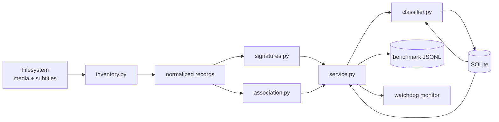
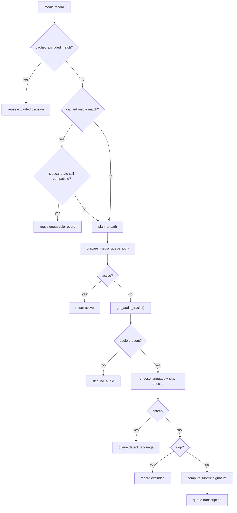

# Startup Scan Backend

This package contains the alternate persistent startup-scan backend for Subgen.

It is intentionally documented separately from the main project README because it introduces:

- a persistent SQLite-backed startup inventory
- directory and inventory fingerprinting
- cache-aware startup classification
- optional benchmark and planner-trace instrumentation

## Scope

This backend is selected with:

- `STARTUP_SCAN_BACKEND=persistent`

The stock path remains:

- `STARTUP_SCAN_BACKEND=legacy`

The persistent backend is designed to make startup behavior incremental:

- persist media/subtitle inventory across restarts
- fingerprint relevant files instead of blindly rescanning everything
- short-circuit warm startup on manifest hits
- isolate startup-specific performance work from the rest of `subgen.py`

## Module Layout

Current package files:

- `__init__.py`
- `adapter.py`
- `association.py`
- `backend.py`
- `benchmarks.py`
- `classifier.py`
- `config.py`
- `db.py`
- `dependencies.py`
- `entrypoint.py`
- `facade.py`
- `forced.py`
- `inventory.py`
- `inventory_cache.py`
- `legacy.py`
- `policy.py`
- `runtime.py`
- `schema.py`
- `service.py`
- `signatures.py`
- `state.py`
- `traversal.py`
- `wiring.py`

High-signal responsibilities:

- `backend.py`: backend selection
- `config.py`: startup-scan env parsing
- `db.py`: SQLite access layer
- `schema.py`: schema and migrations
- `inventory.py`: recursive startup inventory collection
- `inventory_cache.py`: directory cache/fingerprint reuse
- `traversal.py`: filesystem walking and record building
- `association.py`: subtitle/media association helpers
- `signatures.py`: inventory and subtitle fingerprints
- `classifier.py`: queue planning, cache reuse, skip/exclude decisions
- `service.py`: end-to-end persistent startup orchestration
- `benchmarks.py`: optional JSONL timing output
- `forced.py`: forced-language startup path
- `runtime.py`: runtime helpers shared by the seam
- `wiring.py`: subtitle link backfill and package-level glue

## Runtime Flow

```mermaid
flowchart TD
    A["subgen.py seam"] --> B["build_startup_scan_backend()"]
    B -->|persistent| C["service.startup_scan_existing()"]
    B -->|legacy| D["legacy startup path"]

    C --> E["open StartupScanDB"]
    C --> F["collect_startup_inventory()"]
    F --> G["inventory_cache / traversal"]
    F --> H["subtitle/media association"]

    C --> I["compute inventory signature"]
    I --> J{"manifest hit?"}

    J -->|yes| K["optional subtitle relink"]
    K --> L["write summary + start monitor"]

    J -->|no| M["index subtitle rows"]
    M --> N["classify_media()"]
    N --> O["reuse cached records"]
    N --> P["plan skip / queue / detect"]
    N --> Q["upsert media / excluded rows"]
    Q --> R["store inventory signature"]
    R --> L
```



## Data Flow



## Fingerprinting Model

This backend only cares about media files and subtitle files for startup invalidation.

Primary fingerprints:

- directory entry signature
  - built from relevant child directories and relevant file names
  - used for quick directory-cache acceptance
- subtree inventory snapshot
  - serialized cached inventory for a root subtree
  - reused when the root directory still matches
- flat inventory manifest
  - hash over `path:size:mtime` entries for media and subtitle files
  - stored in `scan_meta`
  - used for warm manifest-hit short-circuiting
- subtitle signature
  - hash of matching subtitle files associated with a media file
  - stored per media row
- media probe signature
  - based on media path, file size, and file mtime
  - used by the shared ffprobe cache in `subgen.py`

The persistent backend intentionally ignores unrelated file churn when deciding whether startup metadata is still valid.

## SQLite Schema

Schema version:

- `3`

Main tables:

- `scan_meta`
- `media_files`
- `excluded_files`
- `subtitle_files`
- `directory_state`
- `scan_state`

```mermaid
erDiagram
    scan_meta {
        text key PK
        text value
    }

    media_files {
        text path PK
        text source_path
        integer size
        integer mtime
        text subtitle_signature
        integer has_audio
        text audio_language
        text subtitle_state
        text decision
        text reason
        text policy_signature
        text task_type
        text transcription_type
        text force_language_code
        text audio_tracks_json
        text audio_langs_json
        integer last_seen
    }

    excluded_files {
        text path PK
        text source_path
        integer size
        integer mtime
        text reason
        text details
        text policy_signature
        integer last_seen
    }

    subtitle_files {
        text path PK
        text source_path
        integer size
        integer mtime
        text media_path
        text subtitle_type
        text language
        integer last_seen
    }

    directory_state {
        text path PK
        integer size
        integer mtime
        text child_dirs_json
        text media_files_json
        text subtitle_files_json
        text entries_signature
        text subtree_inventory_json
        integer last_seen
    }

    scan_state {
        text path PK
        integer size
        integer mtime
        text scan_decision
        text reason
        integer updated_at
    }

    media_files ||--o{ subtitle_files : "linked by media_path"
}
```

Practical role of each table:

- `scan_meta`
  - global metadata such as schema version and stored inventory manifests
- `media_files`
  - per-media startup decision state and cached queue-planning metadata
- `excluded_files`
  - files intentionally skipped or excluded during startup planning
- `subtitle_files`
  - discovered subtitle inventory with explicit `media_path` association
- `directory_state`
  - cached directory snapshots and subtree inventory payloads
- `scan_state`
  - reserved generic per-path scan state used by older or auxiliary flows

## Startup Decision Flow



Notable current behavior:

- subtitle signatures are deferred for early `skip` and `active` outcomes
- planner queue preparation now uses `get_audio_tracks()` as the single audio probe in the uncached path
- warm manifest hits can skip full classification entirely

## Benchmark Summary

Detailed measured evidence lives in:

- [startup_scan_pr_benchmarks.md](C:/Users/Nathan/source/subgen/startup_scan_pr_benchmarks.md)

Current headline numbers from that note:

### Full-library persistent warm

| Scenario | `startup_scan.inventory` | `startup_scan.subtitle_relink` | `startup_scan.monitor_setup` | `startup_scan.total` |
| --- | ---: | ---: | ---: | ---: |
| Baseline before stock reset | 1437.274 ms | 112.490 ms | 59.855 ms | 7080.813 ms |
| After seam reapply | 2554.762 ms | 377.958 ms | 36.409 ms | 6205.579 ms |
| Current verification run | 1949.813 ms | 473.110 ms | 102.183 ms | 6826.118 ms |

### `Subset A` cold optimization progression

Sanitized subset:

- media files: `33`
- subtitle files: `34`

| Scenario | `startup_scan.inventory` | `startup_scan.classify_media.parallel_plan` | `startup_scan.classify_media` | `startup_scan.total` |
| --- | ---: | ---: | ---: | ---: |
| Baseline cold | 6748.547 ms | 57940.420 ms | 58059.195 ms | 65310.959 ms |
| After deferring subtitle signatures | 5630.881 ms | 51857.729 ms | 52092.994 ms | 58708.079 ms |
| After single-probe planner path | 5773.772 ms | 33582.755 ms | 33689.213 ms | 39939.568 ms |

Latest measured cold improvement versus baseline:

- `startup_scan.classify_media.parallel_plan`
  - `57940.420 ms` -> `33582.755 ms`
  - improvement: `24357.665 ms`
  - about `42.0%` faster
- `startup_scan.total`
  - `65310.959 ms` -> `39939.568 ms`
  - improvement: `25371.391 ms`
  - about `38.8%` faster

### `Subset A` warm rerun after the latest planner changes

| Scenario | `startup_scan.inventory` | `startup_scan.subtitle_relink` | `startup_scan.monitor_setup` | `startup_scan.total` |
| --- | ---: | ---: | ---: | ---: |
| Warm baseline | 322.967 ms | 14.253 ms | 12.476 ms | 1670.380 ms |
| Latest warm rerun | 34.597 ms | 13.308 ms | 3.844 ms | 371.956 ms |

## Current Bottlenecks

Latest planner-detail measurements show:

- `has_audio()` probe cost in the cold planner path is effectively eliminated
- the remaining cold-time hotspots are now:
  - `audio_tracks_ms_total_ms`
  - `skip_check_ms_total_ms`

Interpretation:

- the next meaningful cold-start target is skip-check work in `describe_skip_reason()`
- `get_audio_tracks()` is still a large remaining probe cost, but it is now the single intentional probe in the planner path rather than duplicated work

## Operational Flags

Main flags for this backend:

- `STARTUP_SCAN_BACKEND`
- `STARTUP_SCAN_DB_PATH`
- `STARTUP_SCAN_BENCHMARK_LOGGING`
- `STARTUP_SCAN_BENCHMARK_LOG_PATH`
- `STARTUP_SCAN_PLANNER_TRACE_LOGGING`
- `STARTUP_SCAN_MONITOR_ASYNC_START`

Expected defaults in the current repo:

- backend defaults to `legacy`
- benchmark logging is opt-in
- planner-trace logging is opt-in

## Maintenance Notes

When this package changes, update this README if any of the following change:

- schema version or table layout
- manifest or fingerprint logic
- startup decision flow
- benchmark methodology or headline benchmark numbers
- persistent/legacy seam shape

Recommended maintenance workflow:

1. update code
2. run targeted tests
3. rerun sanitized cold and warm benchmark containers
4. update [startup_scan_pr_benchmarks.md](C:/Users/Nathan/source/subgen/startup_scan_pr_benchmarks.md)
5. update this README’s diagrams or benchmark summary if the architecture or bottlenecks changed
